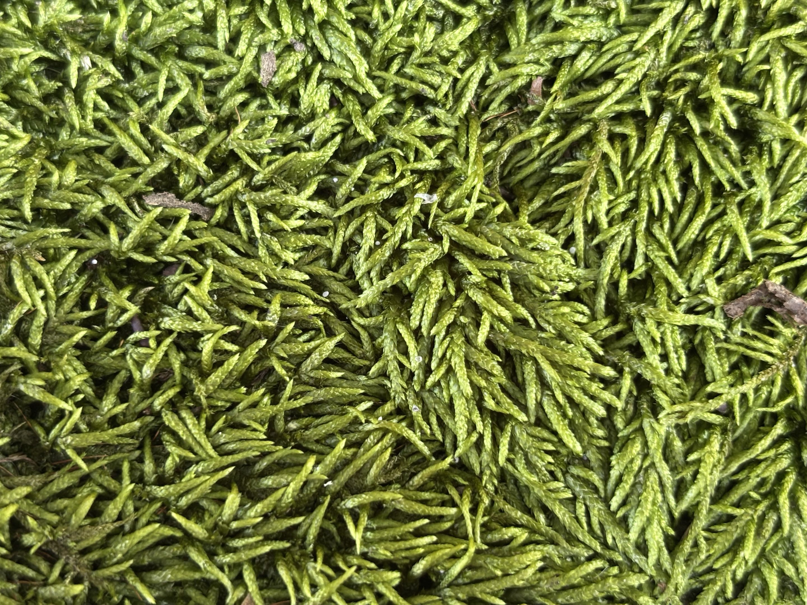

<center>


</center>
## Sobre mi / About me.
 Estudiante de Biologia en UPRM. Interesado en el area de botanica y las briofitas. 

## Experiencias
### Laboratorio de Briologia Tropical: Miembro<br>
  - Miembro activo desarollando un proyecto de investigacion con las     paredes celulares de las briofitas. <br>
    * Plagiochilla
  
### Asociacion de Estudiantes de Biologia: Vocal<br>
  - Actualmente soy miembro activo parte de la directiva, trayendo la perspectiva de plantas en el ambito de la asociacion estudiantil de ecologia. 
  
### Missouri Botanical Garden: REU summer 2026<br>
  - Fui parte del programa de REU en el verano de 2026<br>
  - **Proyecto**: "A review on Moss Genus *Entodon* in North America"<br>
    * Revision taxonomica del genero *Entodon*, conocido por ser musgos pleurocarpicos creciendo en alfombras brillosas y aplastadas. Ademas se resolvio la identidad de lKa especie endemica *Entodon floridanus* la cual se coloco en sinonimia con *Entodon macropodus* 
    
```{r echo=FALSE, warning=FALSE}
library(ggplot2)
```

<br><br>
<br>